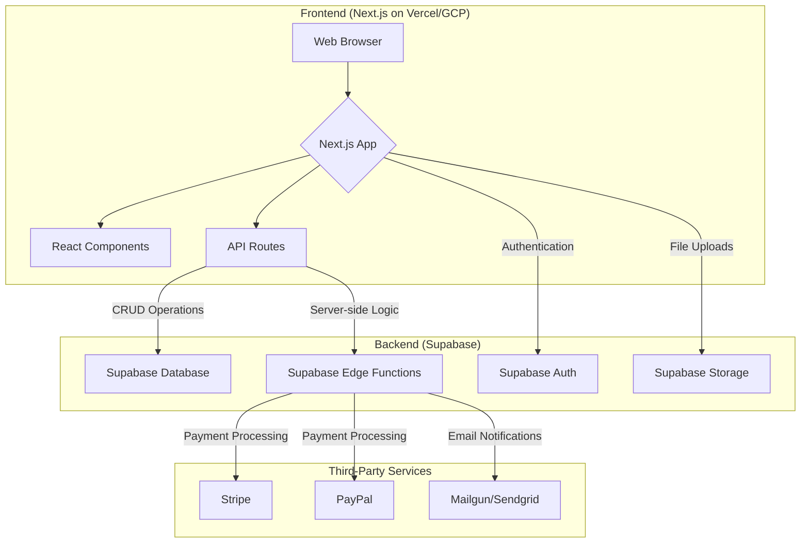

# SoulTrip: Technical Specification

Version: 1.0
Date: August 5, 2025
Project: SoulTrip (also referred to as Sacred Journey Platform, Pilgrimage OS)

## 1. Introduction

This document provides a detailed technical specification for the Minimum Viable Product (MVP) of the SoulTrip platform. It is intended to be used by the development team for implementation. This specification is derived from the original Product Specification and elaborates on the technical architecture, data models, and user stories.

## 2. Core Components & User Roles

### 2.1. Core Components

- **Journey Builder:** A tool for organizers to create and manage tours.
- **Participant Management (CRM):** A system for organizers to manage participants.
- **Payments & Finances:** A module for handling tour payments and tracking revenue.
- **Communication & Automation:** Tools for automated communication with participants.
- **Explore & Discover (Marketplace):** A searchable catalog of tours for participants.
- **Personal Profile & Dashboard:** A personal space for participants to manage their journey.
- **Community Hub:** A feature for fostering community among participants.

### 2.2. User Roles (MVP Focus)

- **Tour Organizer / Facilitator:** Creates and manages tours.
- **Participant / Pilgrim:** Books and participates in tours.
- **Administrator:** Platform moderator.

## 3. Application Architecture

The application will be a monolithic Next.js application that interacts directly with a Supabase backend for data storage, authentication, and serverless functions.

### 3.1. Frontend Components

- **Layout:** Main application shell with navigation, header, and footer.
- **TourCard:** A component to display a summary of a tour in the marketplace.
- **TourDetailsPage:** A full-page view of a single tour.
- **BookingForm:** A form for participants to book a tour.
- **OrganizerDashboard:** A protected area for organizers to manage their tours and participants.
- **ParticipantDashboard:** A protected area for participants to view their bookings and profile.

## 4. Data Models (Supabase Schema)

### `users` (extends `auth.users`)

| Column Name  | Data Type                  | Constraints                        | Description                                           |
| ------------ | -------------------------- | ---------------------------------- | ----------------------------------------------------- |
| `id`         | `uuid`                     | Primary Key, Default: `auth.uid()` | Foreign key to `auth.users.id`                        |
| `full_name`  | `text`                     |                                    | User's full name                                      |
| `avatar_url` | `text`                     |                                    | URL for the user's profile picture                    |
| `role`       | `text`                     | Default: `'participant'`           | User role (e.g., 'participant', 'organizer', 'admin') |
| `created_at` | `timestamp with time zone` | Default: `now()`                   | Timestamp of user creation                            |

### `tours`

| Column Name        | Data Type                  | Constraints                               | Description                                                 |
| ------------------ | -------------------------- | ----------------------------------------- | ----------------------------------------------------------- |
| `id`               | `uuid`                     | Primary Key, Default: `gen_random_uuid()` | Unique identifier for the tour                              |
| `organizer_id`     | `uuid`                     | Foreign Key to `users.id`                 | The user who created the tour                               |
| `title`            | `text`                     | Not Null                                  | Title of the tour                                           |
| `description`      | `text`                     |                                           | Detailed description of the tour                            |
| `itinerary`        | `jsonb`                    |                                           | Day-by-day plan for the tour                                |
| `start_date`       | `date`                     | Not Null                                  | Start date of the tour                                      |
| `end_date`         | `date`                     | Not Null                                  | End date of the tour                                        |
| `price`            | `numeric`                  | Not Null                                  | Cost of the tour                                            |
| `currency`         | `text`                     | Not Null, Default: `'USD'`                | Currency of the tour price                                  |
| `max_participants` | `integer`                  | Not Null                                  | Maximum number of participants                              |
| `status`           | `text`                     | Default: `'draft'`                        | Status of the tour (e.g., 'draft', 'published', 'archived') |
| `created_at`       | `timestamp with time zone` | Default: `now()`                          | Timestamp of tour creation                                  |

### `bookings`

| Column Name      | Data Type                  | Constraints                               | Description                                                       |
| ---------------- | -------------------------- | ----------------------------------------- | ----------------------------------------------------------------- |
| `id`             | `uuid`                     | Primary Key, Default: `gen_random_uuid()` | Unique identifier for the booking                                 |
| `tour_id`        | `uuid`                     | Foreign Key to `tours.id`                 | The tour that was booked                                          |
| `participant_id` | `uuid`                     | Foreign Key to `users.id`                 | The user who made the booking                                     |
| `status`         | `text`                     | Default: `'pending'`                      | Status of the booking (e.g., 'pending', 'confirmed', 'cancelled') |
| `payment_status` | `text`                     | Default: `'unpaid'`                       | Status of the payment (e.g., 'unpaid', 'paid', 'partial')         |
| `created_at`     | `timestamp with time zone` | Default: `now()`                          | Timestamp of booking creation                                     |

### `payments`

| Column Name      | Data Type                  | Constraints                               | Description                                 |
| ---------------- | -------------------------- | ----------------------------------------- | ------------------------------------------- |
| `id`             | `uuid`                     | Primary Key, Default: `gen_random_uuid()` | Unique identifier for the payment           |
| `booking_id`     | `uuid`                     | Foreign Key to `bookings.id`              | The booking associated with the payment     |
| `amount`         | `numeric`                  | Not Null                                  | Amount paid                                 |
| `provider`       | `text`                     | Not Null                                  | Payment provider (e.g., 'stripe', 'paypal') |
| `transaction_id` | `text`                     | Not Null                                  | ID from the payment provider                |
| `created_at`     | `timestamp with time zone` | Default: `now()`                          | Timestamp of payment creation               |

## 5. User Stories (MVP)

### 5.1. For Tour Organizers

- **As a Tour Organizer, I want to** create a new tour with a title, description, price, and dates, **so that** I can publish it on the platform.
- **As a Tour Organizer, I want to** upload photos for my tour, **so that** I can make the tour page more appealing.
- **As a Tour Organizer, I want to** set the maximum number of participants for a tour, **so that** I can manage the tour's capacity.
- **As a Tour Organizer, I want to** view a list of all participants who have booked my tour, **so that** I can track my attendees.
- **As a Tour Organizer, I want to** see the payment status for each booking, **so that** I can manage my finances.

### 5.2. For Participants

- **As a Participant, I want to** browse a catalog of available tours, **so that** I can find a journey that interests me.
- **As a Participant, I want to** filter tours by destination and date, **so that** I can narrow down my choices.
- **As a Participant, I want to** view the detailed page for a tour, including the itinerary and price, **so that** I can make an informed decision.
- **As a Participant, I want to** book a tour and pay for it securely, **so that** I can reserve my spot.
- **As a Participant, I want to** view my upcoming and past bookings in a personal dashboard, **so that** I can keep track of my journeys.

## 6. Technical Stack Summary

- **Frontend:** React / Next.js
- **Backend & Database:** Supabase
- **Hosting:** Vercel / Google Cloud Run
- **Payment Integrations:** Stripe, PayPal
- **Email Service:** Mailgun / Sendgrid
