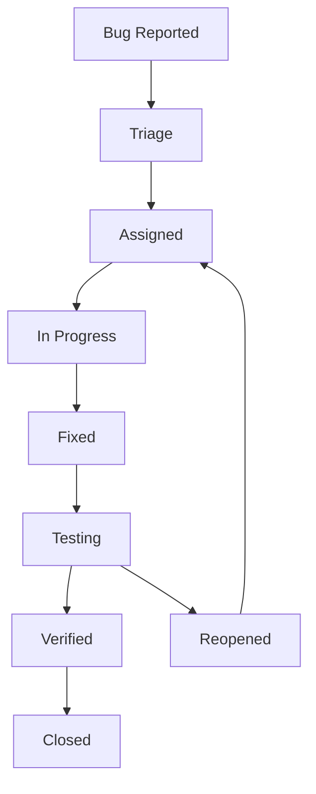

# Quality Assurance Process for SoulTrip

## Overview

The SoulTrip QA process ensures consistent, high-quality delivery through systematic testing, continuous feedback loops, and proactive quality measures throughout the development lifecycle.

## Definition of Done (DoD)

### Feature Development DoD

#### Code Quality Requirements
- [ ] Code review completed by at least 2 reviewers
- [ ] All automated tests pass (unit, integration, E2E)
- [ ] Code coverage >85% for new code, >95% for critical paths
- [ ] Static code analysis passes (ESLint, TypeScript, Sonar)
- [ ] No critical or high security vulnerabilities
- [ ] Performance benchmarks met (load time, API response)
- [ ] Accessibility standards met (WCAG 2.1 AA)

#### Testing Requirements
- [ ] Unit tests written for all business logic
- [ ] Integration tests for API endpoints
- [ ] E2E tests for critical user journeys
- [ ] Security testing completed for sensitive features
- [ ] Cross-browser testing completed
- [ ] Mobile responsive testing completed
- [ ] Load testing for features affecting performance

#### Documentation Requirements
- [ ] API documentation updated (if applicable)
- [ ] User-facing documentation updated
- [ ] Technical documentation for complex features
- [ ] Test cases documented
- [ ] Deployment instructions updated

#### User Experience Requirements
- [ ] Design system compliance verified
- [ ] User journey flows tested
- [ ] Error handling and messaging reviewed
- [ ] Loading states and feedback implemented
- [ ] Accessibility features validated

### Release DoD

#### Pre-Release Checklist
- [ ] All feature DoD items completed
- [ ] Regression testing suite passes
- [ ] Performance testing completed
- [ ] Security scanning passed
- [ ] Database migration tested
- [ ] Environment configuration verified
- [ ] Monitoring and alerting configured
- [ ] Rollback procedure tested
- [ ] Team training completed (if needed)

## Quality Gates

### Gate 1: Development Phase
**Trigger**: Feature branch creation
**Criteria**: 
- Code standards compliance
- Initial unit tests written
- Design approval obtained

**Actions**:
```bash
# Automated checks
npm run lint
npm run type-check
npm run test:unit
npm run security-scan

# Manual reviews
- Code architecture review
- Design implementation review
```

### Gate 2: Integration Phase
**Trigger**: Pull request to develop branch
**Criteria**:
- All automated tests pass
- Code review approved
- Integration tests written
- Performance impact assessed

**Actions**:
```typescript
// Automated pipeline
const integrationGate = {
  codeQuality: {
    coverage: '>85%',
    duplications: '<3%',
    maintainabilityRating: 'A',
    reliabilityRating: 'A',
    securityRating: 'A'
  },
  testing: {
    unitTests: 'pass',
    integrationTests: 'pass',
    securityTests: 'pass'
  },
  performance: {
    buildTime: '<5min',
    bundleSize: 'no increase >10%',
    apiPerformance: 'baseline maintained'
  }
}
```

### Gate 3: Staging Phase
**Trigger**: Merge to main/staging branch
**Criteria**:
- E2E testing suite passes
- UAT completed
- Performance testing passed
- Security audit completed

**Actions**:
```yaml
# Staging deployment pipeline
staging_gate:
  tests:
    - e2e_critical_paths
    - performance_load_test
    - security_penetration_test
    - accessibility_audit
  approvals:
    - product_owner
    - tech_lead
    - qa_lead
```

### Gate 4: Production Release
**Trigger**: Production deployment request
**Criteria**:
- All previous gates passed
- Production readiness checklist completed
- Rollback plan approved
- Monitoring configured

## Bug Tracking & Resolution Workflow

### Bug Classification

#### Severity Levels
**Critical (P0)**
- System down or major functionality broken
- Data loss or corruption
- Security breaches
- Payment processing failures
- SLA: Fix within 2 hours

**High (P1)**
- Major feature not working
- Significant user experience issues
- Performance degradation
- SLA: Fix within 24 hours

**Medium (P2)**
- Minor feature issues
- UI/UX improvements needed
- Non-critical performance issues
- SLA: Fix within 1 week

**Low (P3)**
- Cosmetic issues
- Enhancement requests
- Documentation updates
- SLA: Fix within 1 month

#### Bug Lifecycle


### Bug Triage Process

#### Daily Triage Meeting (15 minutes)
**Participants**: QA Lead, Tech Lead, Product Owner
**Agenda**:
1. Review new bugs (5 minutes)
2. Prioritize critical/high bugs (5 minutes)
3. Assign resources (5 minutes)

#### Triage Criteria
```typescript
interface BugTriageDecision {
  severity: 'critical' | 'high' | 'medium' | 'low'
  priority: 'p0' | 'p1' | 'p2' | 'p3'
  assignee: string
  sprint: string
  labels: string[]
  estimatedEffort: '1d' | '2d' | '1w' | '2w+'
}

const triageBug = (bug: BugReport): BugTriageDecision => {
  // Business impact assessment
  const businessImpact = assessBusinessImpact(bug)
  
  // Technical complexity evaluation
  const technicalComplexity = assessTechnicalComplexity(bug)
  
  // User impact analysis
  const userImpact = assessUserImpact(bug)
  
  return {
    severity: calculateSeverity(businessImpact, userImpact),
    priority: calculatePriority(severity, technicalComplexity),
    assignee: assignBestResource(bug.area, technicalComplexity),
    sprint: determineSprint(priority),
    labels: generateLabels(bug),
    estimatedEffort: estimateEffort(technicalComplexity)
  }
}
```

## Code Review Standards

### Review Checklist

#### Functionality Review
- [ ] Code solves the stated problem correctly
- [ ] Edge cases are handled appropriately
- [ ] Error handling is comprehensive
- [ ] Business logic is correct
- [ ] API contracts are maintained

#### Code Quality Review
- [ ] Code follows project conventions
- [ ] Functions are single-purpose and well-named
- [ ] Complex logic is commented
- [ ] No code duplication
- [ ] Proper abstraction levels

#### Security Review
- [ ] Input validation implemented
- [ ] SQL injection prevention
- [ ] XSS prevention
- [ ] Authentication/authorization checks
- [ ] Sensitive data protection

#### Performance Review
- [ ] No obvious performance bottlenecks
- [ ] Database queries optimized
- [ ] Caching strategy appropriate
- [ ] Memory usage reasonable
- [ ] Async operations handled correctly

#### Testing Review
- [ ] Adequate test coverage
- [ ] Tests are meaningful and maintainable
- [ ] Test data is realistic
- [ ] Tests are independent
- [ ] Integration points tested

### Review Process

#### Review Assignment
```typescript
const assignReviewers = (pullRequest: PullRequest): string[] => {
  const codeArea = identifyCodeArea(pullRequest.files)
  const complexity = assessComplexity(pullRequest)
  
  let reviewers = []
  
  // Always assign area expert
  reviewers.push(getAreaExpert(codeArea))
  
  // Add security reviewer for sensitive changes
  if (isSensitiveArea(codeArea)) {
    reviewers.push(getSecurityExpert())
  }
  
  // Add senior reviewer for complex changes
  if (complexity === 'high') {
    reviewers.push(getSeniorDeveloper())
  }
  
  // Add QA reviewer for user-facing changes
  if (isUserFacing(pullRequest)) {
    reviewers.push(getQALead())
  }
  
  return reviewers
}
```

## Security Checkpoints

### Development Security Gates

#### Pre-Commit Hooks
```bash
#!/bin/sh
# .git/hooks/pre-commit

echo "Running security checks..."

# Secret scanning
if ! npm run secrets-scan; then
    echo "❌ Secrets detected in code"
    exit 1
fi

# Dependency vulnerability check
if ! npm audit --audit-level moderate; then
    echo "❌ Vulnerable dependencies detected"
    exit 1
fi

# Static security analysis
if ! npm run security-lint; then
    echo "❌ Security issues detected in code"
    exit 1
fi

echo "✅ Security checks passed"
```

#### Security Code Review
```typescript
interface SecurityReviewChecklist {
  inputValidation: {
    sqlInjectionPrevention: boolean
    xssPrevention: boolean
    csrfProtection: boolean
    inputSanitization: boolean
  }
  authentication: {
    properAuthChecks: boolean
    sessionManagement: boolean
    passwordSecurity: boolean
    mfaImplementation: boolean
  }
  dataProtection: {
    encryptionAtRest: boolean
    encryptionInTransit: boolean
    piiHandling: boolean
    gdprCompliance: boolean
  }
  accessControl: {
    roleBasedAccess: boolean
    tenantIsolation: boolean
    principleOfLeastPrivilege: boolean
    privilegeEscalationPrevention: boolean
  }
}
```

### Automated Security Testing

#### Security Test Pipeline
```yaml
# .github/workflows/security.yml
name: Security Testing

on:
  push:
    branches: [main, develop]
  pull_request:
    branches: [main]

jobs:
  security-scan:
    runs-on: ubuntu-latest
    steps:
      - uses: actions/checkout@v3
      
      - name: SAST Scan
        uses: securecodewarrior/github-action-add-sarif@v1
        with:
          sarif-file: sast-results.sarif
          
      - name: Dependency Check
        uses: dependency-check/Dependency-Check_Action@main
        with:
          project: 'SoulTrip'
          path: '.'
          
      - name: Container Security Scan
        uses: aquasec/trivy-action@master
        with:
          image-ref: 'soultrip:latest'
          format: 'sarif'
          
      - name: Infrastructure Security
        run: |
          terraform plan -out=tfplan
          checkov -f tfplan
```

## Automated Testing Pipeline

### CI/CD Pipeline Configuration

#### Test Stages
```yaml
# .github/workflows/ci.yml
name: CI/CD Pipeline

on:
  push:
    branches: [main, develop]
  pull_request:
    branches: [main]

jobs:
  test:
    runs-on: ubuntu-latest
    strategy:
      matrix:
        node-version: [18.x, 20.x]
    
    steps:
      - uses: actions/checkout@v3
      
      - name: Setup Node.js
        uses: actions/setup-node@v3
        with:
          node-version: ${{ matrix.node-version }}
          cache: 'npm'
          
      - name: Install dependencies
        run: npm ci
        
      - name: Code quality checks
        run: |
          npm run lint
          npm run type-check
          npm run format-check
          
      - name: Unit tests
        run: npm run test:unit -- --coverage
        
      - name: Integration tests
        run: npm run test:integration
        env:
          DATABASE_URL: ${{ secrets.TEST_DATABASE_URL }}
          
      - name: Security tests
        run: npm run test:security
        
      - name: Upload coverage
        uses: codecov/codecov-action@v3
        
  e2e-tests:
    runs-on: ubuntu-latest
    needs: test
    
    steps:
      - uses: actions/checkout@v3
      
      - name: Setup test environment
        run: |
          docker-compose up -d
          npm run db:migrate:test
          npm run db:seed:test
          
      - name: E2E tests
        run: npm run test:e2e
        
      - name: Performance tests
        run: npm run test:performance
        
      - name: Accessibility tests
        run: npm run test:a11y
        
  security-scan:
    runs-on: ubuntu-latest
    needs: test
    
    steps:
      - uses: actions/checkout@v3
      
      - name: Security scanning
        run: |
          npm run security:scan
          npm run security:audit
          npm run security:secrets-check
```

### Test Environment Management

#### Environment Configuration
```typescript
// config/test-environments.ts
export const testEnvironments = {
  unit: {
    database: 'sqlite::memory:',
    services: 'mocked',
    duration: 'fast'
  },
  integration: {
    database: 'postgresql://test_db',
    services: 'containerized',
    duration: 'medium'
  },
  e2e: {
    database: 'postgresql://e2e_db',
    services: 'full_stack',
    duration: 'slow',
    browser: 'headless'
  },
  performance: {
    database: 'postgresql://perf_db',
    services: 'production_like',
    duration: 'extended',
    metrics: 'enabled'
  }
}
```

#### Test Data Management
```typescript
// utils/test-data-manager.ts
class TestDataManager {
  static async setupTestData(scenario: string) {
    const data = await this.loadTestScenario(scenario)
    
    // Seed database with test data
    await this.seedDatabase(data.database)
    
    // Setup external service mocks
    await this.setupServiceMocks(data.services)
    
    // Configure test users and permissions
    await this.setupTestUsers(data.users)
    
    return data.context
  }
  
  static async cleanupTestData() {
    await this.clearDatabase()
    await this.clearServiceMocks()
    await this.clearTestUsers()
  }
  
  static async createTestTour(organizer: User): Promise<Tour> {
    return await TourFactory.create({
      organizer_id: organizer.id,
      title: 'Test Meditation Retreat',
      location: 'Bali, Indonesia',
      start_date: new Date('2024-12-01'),
      end_date: new Date('2024-12-07'),
      max_participants: 20,
      price: 1500,
      status: 'published'
    })
  }
}
```

## Quality Metrics & Monitoring

### Key Quality Metrics

#### Code Quality Metrics
```typescript
interface CodeQualityMetrics {
  coverage: {
    line_coverage: number      // Target: >85%
    branch_coverage: number    // Target: >80%
    function_coverage: number  // Target: >90%
  }
  complexity: {
    cyclomatic_complexity: number  // Target: <10 per function
    cognitive_complexity: number   // Target: <15 per function
  }
  maintainability: {
    maintainability_index: number // Target: >60
    technical_debt_ratio: number  // Target: <5%
  }
  reliability: {
    bug_density: number           // Target: <1 per KLOC
    defect_removal_efficiency: number // Target: >95%
  }
}
```

#### Testing Metrics
```typescript
interface TestingMetrics {
  testAutomation: {
    automation_rate: number        // Target: >80%
    test_execution_time: number    // Target: <30min
    flaky_test_rate: number       // Target: <2%
  }
  bugMetrics: {
    bug_detection_rate: number     // Bugs found in testing vs production
    bug_resolution_time: number    // Average time to fix
    bug_recurrence_rate: number    // Target: <5%
  }
  performanceMetrics: {
    load_test_pass_rate: number    // Target: 100%
    performance_regression_rate: number // Target: <1%
  }
}
```

### Quality Dashboard

#### Real-time Quality Monitoring
```typescript
// monitoring/quality-dashboard.ts
class QualityDashboard {
  static async generateQualityReport(): Promise<QualityReport> {
    const codeQuality = await this.getCodeQualityMetrics()
    const testMetrics = await this.getTestMetrics()
    const bugMetrics = await this.getBugMetrics()
    const securityMetrics = await this.getSecurityMetrics()
    
    return {
      overall_score: this.calculateOverallScore(codeQuality, testMetrics, bugMetrics, securityMetrics),
      trend: this.calculateTrend(),
      recommendations: this.generateRecommendations(),
      metrics: {
        code_quality: codeQuality,
        testing: testMetrics,
        bugs: bugMetrics,
        security: securityMetrics
      }
    }
  }
  
  static async trackQualityTrends() {
    const currentMetrics = await this.generateQualityReport()
    const historicalMetrics = await this.getHistoricalData(30) // Last 30 days
    
    return {
      improvements: this.identifyImprovements(currentMetrics, historicalMetrics),
      regressions: this.identifyRegressions(currentMetrics, historicalMetrics),
      alerts: this.generateAlerts(currentMetrics)
    }
  }
}
```

## Continuous Improvement Process

### Quality Retrospectives

#### Monthly Quality Review
**Agenda**:
1. Quality metrics review (15 min)
2. Bug trend analysis (10 min)
3. Process improvement discussions (20 min)
4. Action items planning (15 min)

**Outcomes**:
- Quality improvement action items
- Process adjustments
- Training needs identification
- Tool and infrastructure improvements

#### Post-Release Quality Analysis
```typescript
interface PostReleaseAnalysis {
  bugAnalysis: {
    bugs_found_post_release: number
    root_cause_analysis: string[]
    prevention_measures: string[]
  }
  performanceAnalysis: {
    performance_issues: number
    user_impact_assessment: string
    optimization_opportunities: string[]
  }
  processEffectiveness: {
    qa_process_gaps: string[]
    testing_coverage_gaps: string[]
    improvement_recommendations: string[]
  }
}
```

This comprehensive QA process ensures that SoulTrip maintains high quality standards while enabling rapid, safe delivery of new features and improvements.